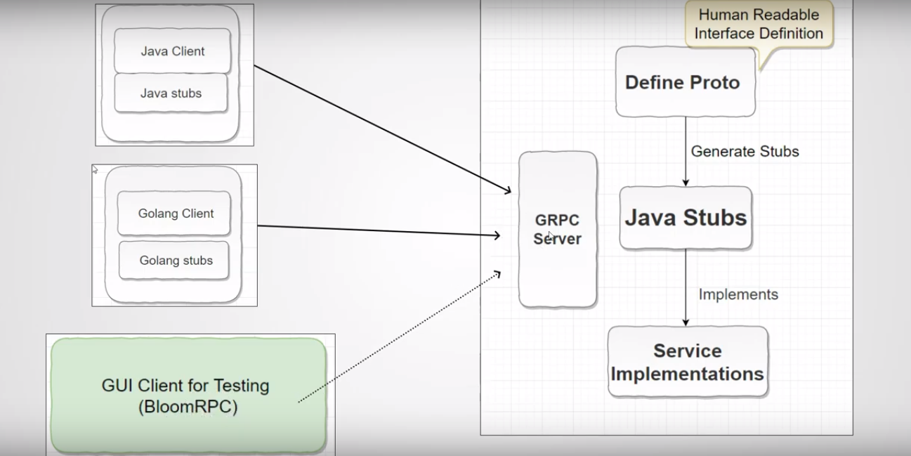

##  Spring Boot with gRPC starter-protobuf(proto3) and Eureka for Building Microservices

### Service Discovery: Eureka Clients:
Service Discovery is one of the key tenets of a microservice-based architecture. Trying to hand-configure each client or some form of convention can be difficult to do and can be brittle. Eureka is the Netflix Service Discovery Server and Client. The server can be configured and deployed to be highly available, with each server replicating state about the registered services to the others.

### Registering with Eureka:
When a client registers with Eureka, it provides meta-data about itself — such as host, port, health indicator URL, home page, and other details. Eureka receives heartbeat messages from each instance belonging to a service. If the heartbeat fails over a configurable timetable, the instance is normally removed from the registry

### Spring Boot and gRPC Starter?
Auto-configures and runs the embedded gRPC server with @GRpcService-enabled beans as part of spring-boot application.

### Why gRPC?
gRPC is a modern open source high performance RPC framework that can run in any environment. It can efficiently connect services in and across data centers with pluggable support for load balancing, tracing, health checking and authentication. It is also applicable in last mile of distributed computing to connect devices, mobile applications and browsers to backend services.
- Simple service definition:    
Define your service using Protocol Buffers, a powerful binary serialization toolset and language
- Works across languages and platforms:     
Automatically generate idiomatic client and server stubs for your service in a variety of languages and platforms
- Start quickly and scale:  
Install runtime and dev environments with a single line and also scale to millions of RPCs per second with the framework
- Bi-directional streaming and integrated auth:     
Bi-directional streaming and fully integrated pluggable authentication with HTTP/2-based transport

### Working with Protocol Buffers:
By default, gRPC uses Protocol Buffers, Google’s mature open source mechanism for serializing structured data (although it can be used with other data formats such as JSON)

### Why HTTP/2?
gRPC uses HTTP/2 as its transfer protocol, so it inherits some great features that HTTP/2 offers, such as binary framing, which is high performance and robust, lighter to transport and safer to decode compared to other text-based protocols. And because it’s binary, it’s a great combination with protocol buffer.

HTTP/2 also compresses the headers using HPACK, which will reduce the overhead cost and improve the performance.

Multiplexing is possible in HTTP/2, which means the client and server can send multiple requests and responses in parallel over a single TCP connection. This will help reduce the latency and improve network utilisation.

Finally, HTTP/2 allows server-push, where with 1 single request from client, server can send back multiple responses. This is extremely valuable to reduce the round-trip latency between client and server in many cases, when server knows exactly what resources client will need and send them before they’re even requested.

We can check HTTP/2 in http://http2demo.io for check performance with HTTP/1.1

So gRPC:
- is binary based. more efficient on the network , more efficient on cpu
- supports multiple languages c++,Objective-c,PHP,python,Ruby,Node.js,Go,C#,Java
- defines an interface , defines package and the payload. every field has a tag number.
- uses Stubby a RPC framework by google for very high traffic on requests O(10^10)=10,000,000,000 RPC calls per second

### On The Server We Have:
1. proto files = human readable interface files to generate java stubs by maven plugin
2. java stubs = java abstract classes that will be used by us to implement our services
3. java service implementation = our implementation code for java stubs
4. gRPC server = a server that let communicate client and server

### On The Client We Have:
1. java stubs = interfaces that can be called

### Messages and Enum Sample: 
https://medium.com/@akhaku/protobuf-definition-best-practices-87f281576f31

### Defining Service Method and Message Names Standards: 
https://developers.google.com/protocol-buffers/docs/style

### Variable Types in Proto:
https://developers.google.com/protocol-buffers/docs/proto3#scalar

### Samples by Google: 
https://github.com/protocolbuffers/protobuf/releases/tag/v3.12.3

### Exception Handling in gRPC: 
https://grpc.io/docs/guides/error/
### Wrapper Google Types Setting in pom.xml: 
https://github.com/DKE-Data/agrirouter-api-protobuf-definitions/pull/16/files
### Null Values in proto: 
https://itnext.io/protobuf-and-null-support-1908a15311b6

further references:     
- https://grpc.io/docs/what-is-grpc/core-concepts/
- https://grpc.io/blog/grpc-on-http2/
- https://spring.io/blog/2015/03/22/using-google-protocol-buffers-with-spring-mvc-based-rest-services
- https://github.com/LogNet/grpc-spring-boot-starter

### Project Descriptions:
please see application.properties files in resources folder and select a active profile "dev" or "com" to run project. you can check test methods too.  

tips:
- install "Protocol Buffer Editor" (https://plugins.jetbrains.com/plugin/14004-protocol-buffer-editor) for IntelijIDEA to detect .proto files (IntelijIDEA: File -> Settings -> Plugins -> search "Protocol Buffer Editor" and install and restart IDE.)
- in IntelijIDEA for build stub files from proto file: view menu>tool windows>maven>start
- BloomRPC: GUI Client for gRPC services. Inspired by Postman and GraphQL Playground BloomRPC aims to provide the simplest and most efficient developer experience for exploring and querying your gRPC services. Download at : https://github.com/uw-labs/bloomrpc/releases

Steps by Video:
- gRPC Project Setup in Java:
    - https://www.youtube.com/watch?v=JFzAe9SvNaU
    - https://medium.com/@akhaku/protobuf-definition-best-practices-87f281576f31
- How to create gRPC Proto files and Generate Java Stubs:
    - https://www.youtube.com/watch?v=-nxoD-2Mx6I
- Implementing gRPC Service in Java:
    - https://www.youtube.com/watch?v=2hjIn3kKXuo
- How to Start gRPC Server in Java:
    - https://www.youtube.com/watch?v=EaD8SwgWlNU
- How To Test gRPC Services Using GUI client:
    - https://www.youtube.com/watch?v=27HLPHLOwEQ&list=PLI5t0u6ye3FGXJMh5kU2RvN0xrul67p7R&index=5
- gRPC Client Implementation in Java:   
    - https://www.youtube.com/watch?v=eUu29SrGYTA
- Source code:
    - https://github.com/yrreddy0123/yrrhelp/tree/master/grpcDemo
- gRPC Java - Build Modern API & Microservices:
    - https://www.youtube.com/watch?v=XRXTsQwyZSU&list=PLt1SIbA8guusAJIBS8JgbSFKfQdVkWDbl
    
### IntellliJ IDEA Configurations:
- IntelijIDEA: Help -> Edit Custom Vm Options -> add these two line:
    - -Dfile.encoding=UTF-8
    - -Dconsole.encoding=UTF-8
- IntelijIDEA: File -> Settings -> Editor -> File Encodings-> Project Encoding: form "System default" to UTF-8. May be it affected somehow.
- IntelijIDEA: File -> Settings -> Editor -> General -> Code Completion -> check "show the documentation popup in 500 ms"
- IntelijIDEA: File -> Settings -> Editor -> General -> Auto Import -> check "Optimize imports on the fly (for current project)"
- IntelijIDEA: File -> Settings -> Editor -> Color Scheme -> Color Scheme Font -> Scheme: Default -> uncheck "Show only monospaced fonts" and set font to "Tahoma"
- IntelijIDEA: Run -> Edit Configuration -> Spring Boot -> XXXApplication -> Configuration -> Environment -> VM Options: -Dspring.profiles.active=dev
- IntelijIDEA: Run -> Edit Configuration -> Spring Boot -> XXXApplication -> Code Coverage -> Fix the package in include box

